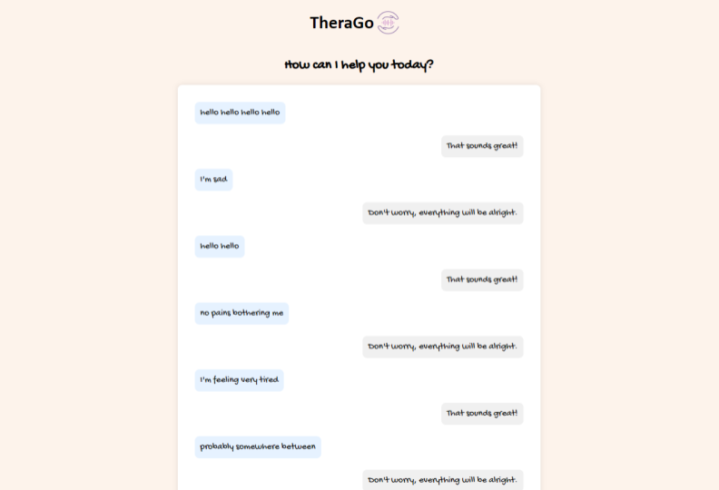

# Therago | AI Assisted Mental Wellbeing WebApp

# Introduction
Welcome to Therago - your personal mental well-being assistant. Therago is designed to **provide support, guidance, and resources** to help you **navigate your life journey with ease and convenience.** 

*Putting your feelings to words can be hard. But we’ve got you covered.*

# Problem Statement
In today's fast-paced society characterised by an excess of well-being services, individuals often face challenges in accessing the appropriate resources to support their mental health and overall well-being. This dilemma results in two significant outcomes: on one end, individuals experience burnout due to the inability to effectively manage their mental health needs, while on the other, there is a noticeable trend of inefficient resource allocation and heightened demand for services. A key reason behind this issue is the prevailing lack of time, support, and clarity among individuals to engage in meaningful self-reflection and seek timely corresponding assistance. Individuals find themselves increasingly overworked and overloaded with information, impacting their ability to prioritise and address their well-being and responsibilities effectively.

# Solution Overview

Therago leverages **Cohere AI's text classification - sentiment analysis** to facilitate personalised support for users with their ongoing responsibilities, difficulties and emotions, thereby improving mental well-being. By _analysing the user's conversation and text inputs with the app_, Therago **extracts key information** to help structure their thoughts, provide tailored advice, remind of ‘to-do’ tasks and facilitate connections with suitable therapy services via third-party platforms if needed. In the case of the latter, this approach ensures an efficient healthcare experience for users, customised to their unique needs and symptoms.

Through a user-friendly interface, Therago allows users to easily record voice messages or write text and receive responses as if they were talking to a friend, promoting emotional expression and providing supportive guidance, empowering users to navigate their day-to-day life with confidence and clarity.

# Key Features

- **Voice Messaging:** Users can record voice messages to express their emotions and thoughts, receiving personalised responses tailored to their needs.

- **Symptom Matching:** Therago utilises the XYZ to match users with appropriate healthcare services based on their needs, ensuring efficient resource allocation and timely access to care.

- **Appointment Scheduling:** The app suggests scheduling appointments with therapists for users experiencing persistent negative emotions or mental health concerns, making therapy more valuable. Using the journal, app users can converse about their feelings more confidently and precisely, receiving better support. Should we add the feature ‘create my mental well-being profile’ for a brief overview of the patient? 

- **Journaling:** Therago simplifies journaling by providing intuitive tools and prompts to help users reflect on their feelings and track their mental well-being over time.
Productivity Tools: Integrated reminders (extracted from the speech about ‘to-do’ tasks) help users manage their time effectively and stay focused on their goals while maintaining their mental health.

# How It Works
**User Registration:** Sign up for Therago

**Symptom/ Mood Recording:** Record voice messages, share your thoughts in a text form or input written entries to express your emotions and concerns.

**AI Interaction:** Receive personalised responses and guidance from Therago's AI assistant, designed to simulate a supportive friend.

**Service Matching: [Incoming Update]** Based on your needs and preferences, Therago can also suggest relevant healthcare services and resources to support your mental well-being.

# Benefits for users 
- Convenient access to mental health support anytime, anywhere.
- Personalised guidance and resources tailored to your needs.
- Simplified journaling and emotional expression = no need to build a habit, just talk. 
- Efficient matching with appropriate healthcare services.
- Enhanced productivity while maintaining mental well-being.

# Pitch Deck
*Prepared by Clarissa Ch'ng Si-En and Anastasiia Guseva*
<embed src="images/TheraGo-PitchDeck.pdf" type="application/pdf" width="100%" height="300px" />

